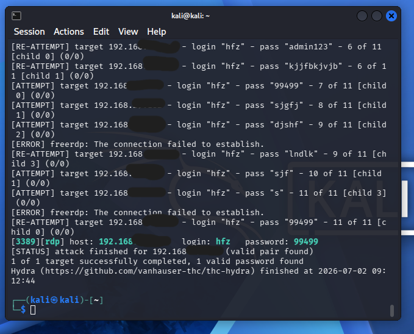
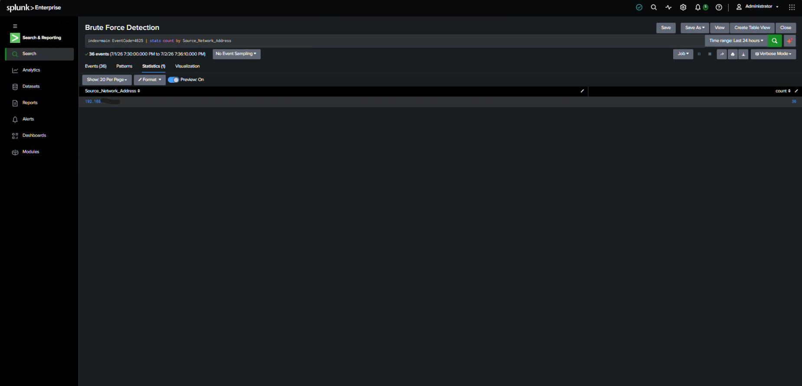
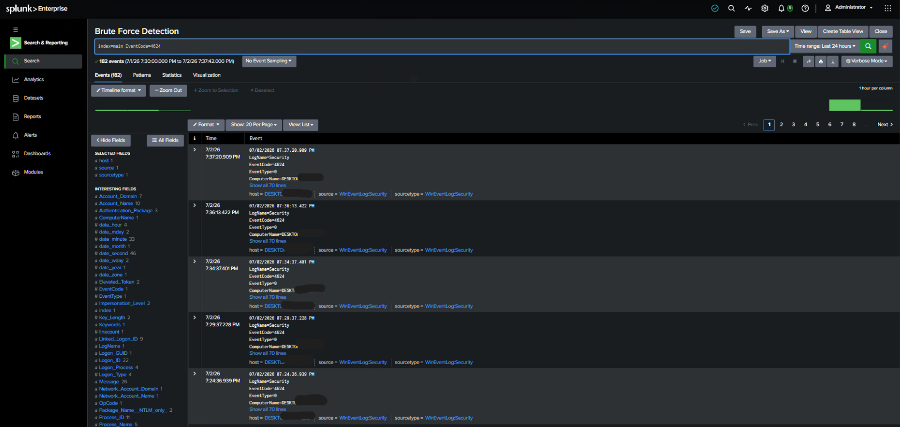
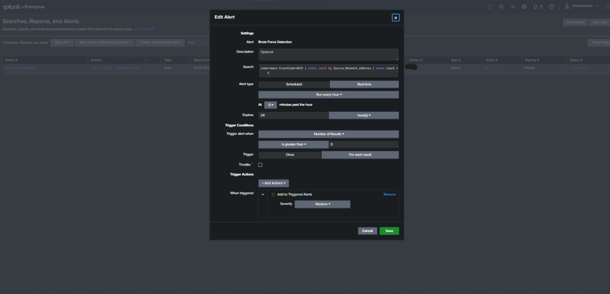
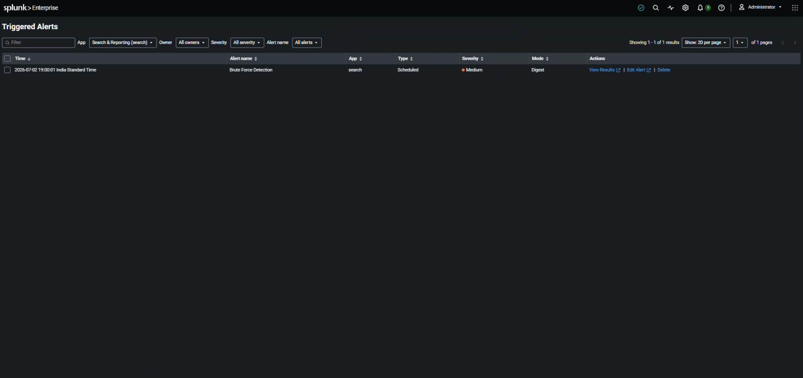

# RDP Brute-Force Attack Detection — Home SOC Lab

## Project Overview
Simulated a real-world RDP brute-force attack in a home lab environment 
and detected it using Sysmon and Splunk. Built a working detection alert 
that fires when failed login attempts exceed a threshold.

---

## Lab Architecture

| Machine | Role | OS |
|---|---|---|
| Main PC | Attacker | Kali Linux (VirtualBox) |
| Spare PC | Victim + Monitor | Windows 10 |

**Tools Used:**
- Sysmon (SwiftOnSecurity config)
- Splunk Enterprise (Free)
- Hydra (brute-force tool)

---

## Attack Simulation

**Tool:** Hydra  
**Target:** RDP (port 3389)  
**Target IP:** 192.168.1.x (private lab network)  
**Command used:**
hydra -l labuser -P passwords.txt rdp://192.168.1.x -V -f

**Result:** Hydra successfully found the correct password after 
fewer than 10 attempts.

**Screenshot:**

---

## Detection

### Event ID 4625 — Failed Logon
Multiple failed logon attempts from a single source IP detected in 
Splunk shortly after the attack began.

**Splunk Query:**
index=main EventCode=4625 | stats count by IpAddress, TargetUserName

**Screenshot:**

### Event ID 4624 — Successful Logon
Successful logon (Logon Type 10 — RemoteInteractive) detected 
immediately after the failed attempts, confirming the attacker gained 
access to the account within the 1–5 minute attack window.

**Splunk Query:**
index=main EventCode=4624

**Screenshot:**

---

## Detection Rule (Splunk Alert)
index=main EventCode=4625 | stats count by IpAddress | where count > 5
**Alert name:** Brute Force Detection  
**Trigger condition:** More than 5 failed logins from same IP  
**Run frequency:** Every 5 minutes  
**Status:** Built and tested — alert successfully fired during the 
simulated attack.

**Screenshot:**

---

## MITRE ATT&CK Mapping

| Technique | ID | Description |
|---|---|---|
| Brute Force | T1110 | Password guessing via Hydra |
| Valid Accounts | T1078 | Attacker logs in with cracked credentials |
| Remote Services | T1021.001 | RDP used as access method |

---

## Key Takeaways
- Event ID 4625 spikes are a reliable indicator of brute-force activity
- Correlating 4625 failures followed by a 4624 success confirms a 
  successful brute-force login
- A working Splunk alert was able to detect this pattern in near 
  real-time (within the 5-minute run interval)
- A short attack window (under 5 minutes) shows how quickly a weak 
  password can be compromised without proper account lockout policies

---

## What I Would Do Next (SOC Analyst Perspective)
- Block the attacking IP at the firewall
- Reset the compromised account's password immediately
- Check Event ID 4648 for any lateral movement after login
- Escalate to Tier 2 if internal IP is the source (insider threat)
- Enable Network Level Authentication (NLA) and account lockout 
  policies to prevent this attack pattern in production environments
